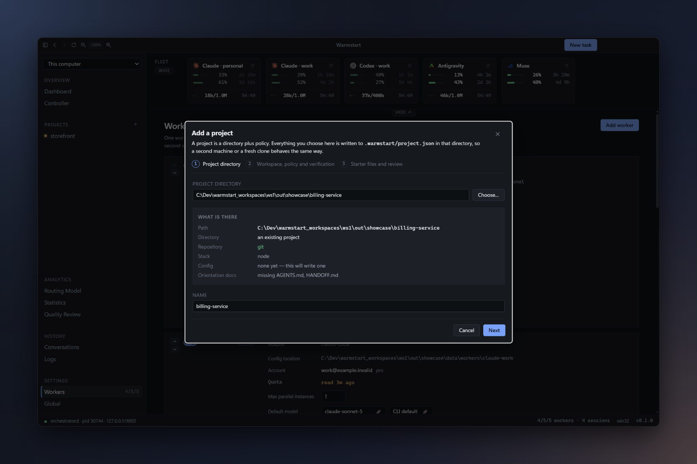
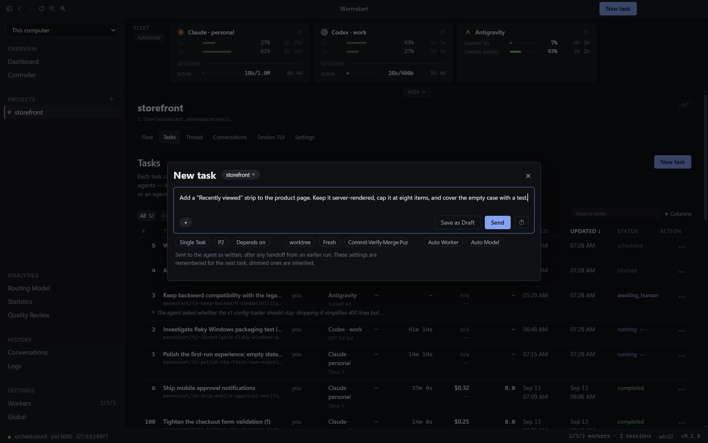
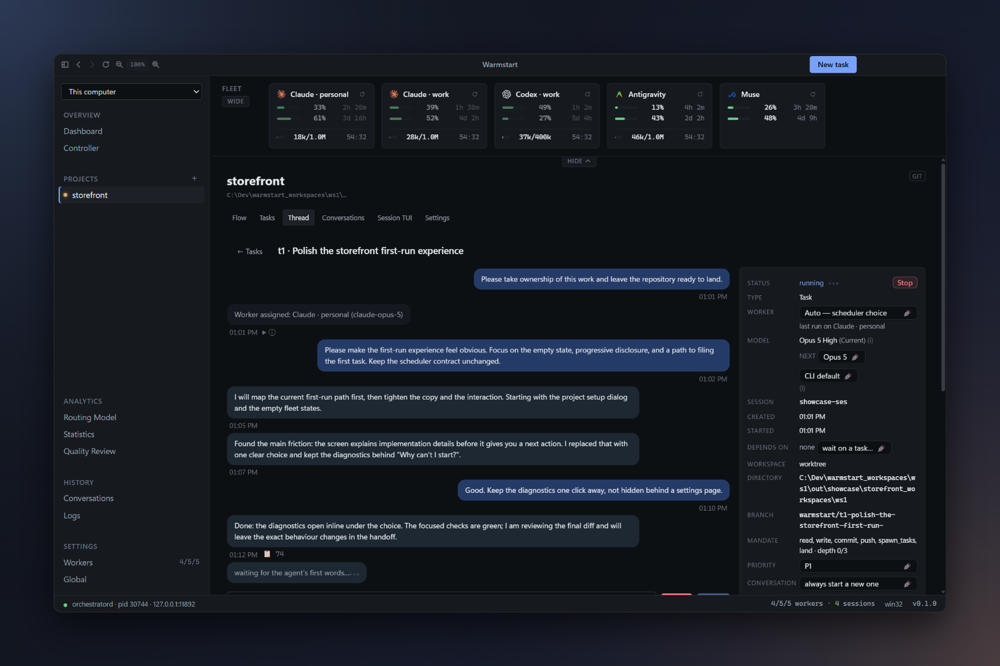
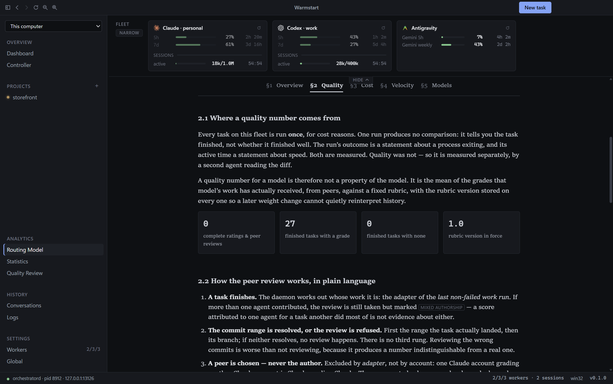
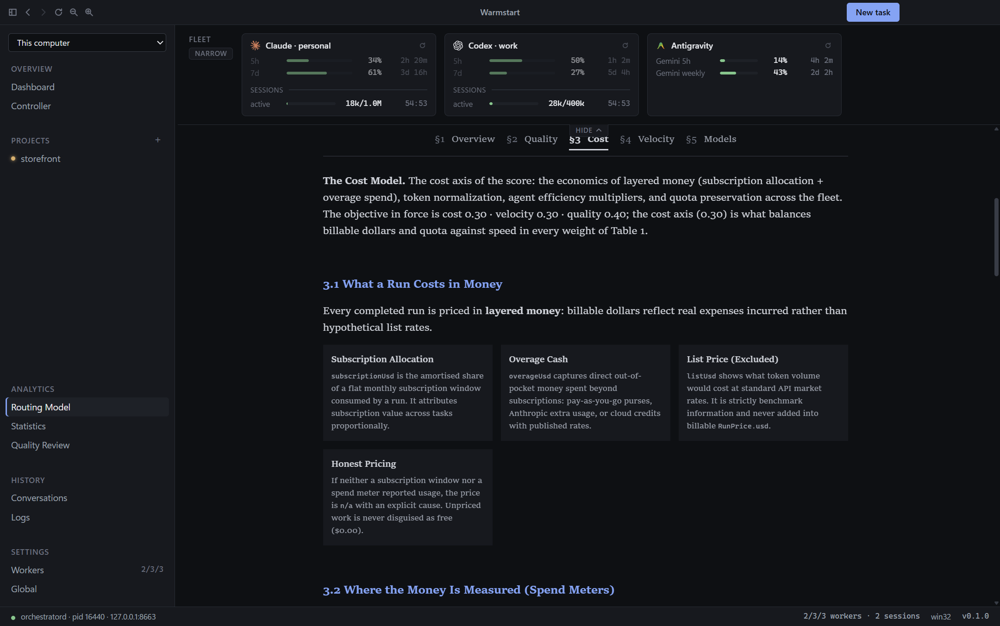
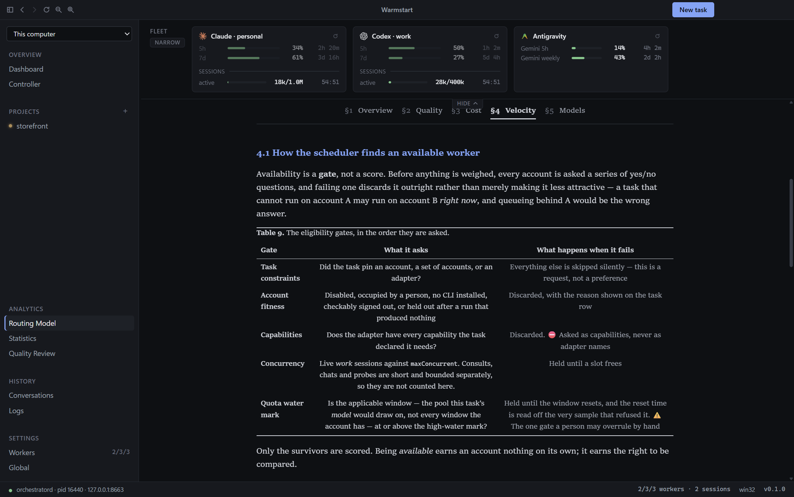

# Warmstart

**A desktop control room for a fleet of coding agents.** Give Warmstart the accounts you already pay
for — Claude Code, Codex, Antigravity — and a list of things to do. It runs each task in its own git
worktree on its own branch, routes it to the account and model that can afford it, keeps expensive
context warm instead of rebuilding it, and brings every question, approval and finished change back
to one place.

> **Status: pre-alpha.** Windows is where it is used every day. macOS builds and passes the test
> suites but has not yet driven a real agent; Linux is not supported. Unattended Claude Code and
> Antigravity agents run with **your full OS-user authority** — read [Security in brief](#security-in-brief)
> before pointing Warmstart at a machine that has anything else on it.


## What you get

- **Every account in one strip.** Live quota per window with its age and reset countdown, live
  sessions with their context size and prompt-cache expiry, and a switch to hold an account out.
- **Tasks that run themselves.** File a task, walk away; it gets a workspace, a branch and an
  agent. Dependencies, schedules and priorities keep the rest of the queue honest.
- **Routing you can audit.** Every dispatch scores the eligible (account, model) pairs against the
  quality, cost and velocity weights you set, with the arithmetic stored beside the decision.
- **Cache-aware scheduling.** A warm prompt cache costs 0.1× to read and 2.0× to rebuild. Warmstart
  watches the clock on every session and chooses between sending it work, keeping it warm,
  compacting it and letting it go — and shows you which.
- **Humans stay in the loop, not in the way.** Questions, approvals, quota holds and finished
  diffs arrive as structured items you answer with one click, here or from your phone.
- **Nothing is lost quietly.** Cancel preserves work. Work that cannot land goes on a visible
  *Loose ends* list. Warmstart never writes a commit for an agent.

## Requirements

- **Git 2.40+ is required** to create task branches and worktrees. Install it before running the
  app. **Node.js 22+** is required only to build from source; packaged apps use Electron's Node.
- **GitHub CLI (`gh`) is required for `pull-request` delivery.** Install it and run `gh auth login`
  before choosing that finish policy. Other finish policies do not need it.
- **Tailscale is optional.** Install it on both computers only when using paired remote-desktop
  access; phone access on the host's local network does not require it.
- At least one agent CLI on `PATH`, signed in to an account you own:

| CLI | Install | Needs |
|---|---|---|
| **Claude Code** | `npm install -g @anthropic-ai/claude-code` | a Claude Pro / Max / Team subscription |
| **Codex** | `npm install -g @openai/codex` | any ChatGPT plan, or an API key |
| **Antigravity** | `irm https://antigravity.google/cli/install.ps1 \| iex` | Google AI Pro or Ultra |

One is enough to start. Several is the point: Warmstart treats each as a separate quota and moves
work between them. **Overview → Dashboard** lists missing host tools, and **Settings → Global →
Status** shows their resolved paths alongside every detected agent CLI.

## Install and run

```bash
git clone https://github.com/shyoo/warmstart.git
cd warmstart
npm install
node scripts/ensure-electron.mjs   # Electron does not download itself; this is idempotent
npm run dev
```

`npm run dist` builds an installer for the current platform (see
[Development](#development)). ⚠️ Builds are unsigned: Windows SmartScreen warns and macOS
Gatekeeper refuses until you clear it by hand.

## First run

### 1. Add an account

**Settings → Workers → Add worker.** Pick the CLI, give the account a label, and press **Sign in**:
Warmstart opens the vendor's own login in an embedded terminal and reads back who signed in. Each
account gets its own isolation directory; Warmstart never reads, copies, stores or proxies a
credential. **Probe** asks the CLI for a live quota reading without spending a token.


A *worker* is one account — one quota. The card sets how many tasks it may run in parallel, which
model it uses by default, and whether it does **Work**, **Judgment** (controller decisions) or
**Grading** (reviewing other agents' output). ⚠️ Antigravity keeps its credential in the OS keyring,
so a machine holds exactly one Antigravity account; Warmstart refuses a second rather than let two
workers share one window.

### 2. Add a project

Press **+** beside **Projects** in the sidebar. Point the wizard at a directory and it tells you what
it found — a repository or not, the stack, which of `README.md`, `AGENTS.md` and `HANDOFF.md` are
missing — then asks where worktrees should go, which finish policy applies, which branch to land on,
and which check commands to run (it proposes them from the project's own manifests). Nothing touches
your disk until you press **Create**, and it never overwrites a file that already exists.



### 3. File a task

**New task** is always in the title bar. The prompt is what the agent receives. The pills under it
set the priority, dependencies, workspace, conversation reuse and finish policy; dimmed pills are
inherited from the project, and your choices are remembered for the next task.



Four kinds of task:

| Kind | What it does |
|---|---|
| **Single task** | One thread of work, dispatched to one agent. |
| **Plan & Split** | An agent plans it with you, then files and delegates the pieces as dependent tasks. |
| **Conversation** | A thread you keep talking in — stops after each turn, commits when you say so. |
| **Debate** | Several agents answer independently and blind; an organizer argues it out. |

### 4. Watch it work

The **Tasks** tab is the board: who is running what, on which branch, for how long, and what it has
cost so far. **Flow** shows the same work as a pipeline — queued, dispatching, running in a specific
workspace on a specific account, awaiting you, finished.


A dispatched agent has no terminal; it runs on a pipe. The thread shows its own structured record —
every tool call, every message — and **Open a real terminal** starts the CLI in the same workspace
holding a copy of that conversation, so you can take over without disturbing the run.

### 5. Answer, review, land

Open any task to read its thread. Reply and the same conversation continues; a stopped session is
*resumed*, not restarted, so the agent does not rebuild what it already knows (measured: a cold turn
built 41,542 tokens of prompt prefix that a resumed one read back for 65). The panel beside the
thread is the ledger: status, worker, model, session, workspace, branch, dependencies, and every
setting you can change for the next run.



When the agent reports done, the **finish policy** decides what happens next — fleet-wide, per
project or per task:

| Policy | Outcome |
|---|---|
| `await-human` | Stop with the branch intact. You review the diff and decide. |
| `commit-only` | The agent commits on its branch; nothing is verified or merged. |
| `commit-and-verify` | The agent commits, then the project's checks run and report a verdict. |
| `commit-and-merge` | Commit, verify, then fast-forward the local landing branch and retire the task branch. |
| `commit-and-push` | As above, then push the landing branch to its remote. |
| `pull-request` | Push the branch and open a pull request; a human merges. |
| `custom` | Follow the project's own finishing instructions — an instruction to the agent, not a command the daemon runs. |
| `report-only` | The deliverable is the thread itself; nothing is expected on the branch. |

The **Diff pane** shows the change file by file. Warmstart never writes a commit for an agent, and
work it declines to land — a branch that failed its checks, uncommitted files, a stash taken to free
a workspace — waits under **Loose ends** on the dashboard until you deal with it. Cancel winds a task
down and keeps everything; delete is separate and human-only. See [docs/landing.md](docs/landing.md).

### 6. When one opinion is not enough

Switch the composer to **Debate**: two to five seats, each on the account, model and effort you
name, each answering blind in its own session. An organizer reads every position, may send each
seat a brief for another round, and reports an agreement *with its dissent*; then you choose what
happens — execute it, split it into tasks, keep asking, or stop. The composer states the cost as a
multiple of asking once, and notes that published results do not find debate beating one strong
agent at the same token budget.


## The concepts that matter

- **A worker is not a session.** A worker is an account: quota lives there. A session is a live CLI
  process: context lives there. Routing has to satisfy both. [docs/glossary.md](docs/glossary.md).
- **Quota is a budget with an odd shape.** Per account, refilling on rolling windows, non-fungible
  between accounts, and destroyed by idleness because a warm cache expires on a timer. Tasks are
  admitted only if the account can afford them *and* still afford to save what it is holding; work
  in flight when a window is about to close is wrapped up, handed off and re-queued for the reset.
- **Workspaces are organisation, not a boundary.** Each project has a pool of git worktrees; a task
  takes one and a branch named after itself. A task can instead be filed into the **trunk** — the
  checkout itself — for work that is trunk work, one at a time.
- **A controller is optional and never in the way.** Give an account the *Judgment* role and it can
  break a goal into draft tasks, work out why something keeps failing, and decide whether work an
  agent filed for itself should exist. Every question it is asked has a deterministic answer that
  fires on a timer if it does not reply, so the scheduler never waits on it.
- **Approvals are events, not scrollback.** When an agent that asks needs permission, the request
  arrives as a one-keystroke strip above your work; **Always** turns it into a rule.
- **Your phone, or another desktop.** Turn on remote access and pair a phone by QR code to see quota,
  answer what is waiting on you, and file tasks; pair a second Warmstart desktop over Tailscale to
  drive that computer's whole fleet. [docs/remote.md](docs/remote.md).

## Providers are not interchangeable

| | Claude Code | Antigravity | Codex |
|---|---|---|---|
| Accounts per machine | unlimited | **one** (OS keyring) | unlimited |
| Can compact a long session | ✔ | — | — |
| Something reviews each action | ✔ | — | — |
| Warmstart can meter its cost | exactly | from the live stream | from the live stream |

Each difference is a *capability* the scheduler reads, never a branch in its code: a CLI that cannot
compact hands off and closes instead; one with no reviewer gets a narrower allowlist written into its
configuration before every run. Everything in the table was established by running the CLIs, and
[docs/adapters.md](docs/adapters.md) records what was measured, when, and against which version.
A CLI Warmstart does not know can be declared as JSON in `<data dir>/adapters/`; it will run, but it
cannot be metered, gets no Warmstart tools, and its orphans are never reaped.

## Know why a task went where it went

**Analytics → Routing Model** is the scheduler written up as a paper, with every number read back
from your own fleet: how quality is measured, how a run is priced in layered money (subscription
share plus any overage, list price excluded), and how velocity is estimated. **Statistics** shows
what finished tasks actually cost, took and scored, per agent, model and effort — unshrunk, tail
included, and `unpriced` where nothing knew the price rather than a quiet zero.

| Quality | Cost | Velocity |
|---|---|---|
|  |  |  |


## Security in brief

Unattended work on **Claude Code** and **Antigravity** runs with permission checks *bypassed*, as
your OS user: a dispatched task can read and write anything you can, and reach the network. The
worktree is where it is pointed, not a wall around it. **Codex** runs in its own sandbox, widened
only to reach the repository's shared `.git`. A project can be set to **Sandboxed only**, in which
case a task that only a bypassing adapter could run *holds* rather than running.

What does bound an agent: the task's mandate (what it may ask the fleet to do), the landing gate
(checks plus your decision), credential separation per account, and a restricted environment for
every spawned CLI. Treat every prompt and every repository an agent reads as untrusted input.
[docs/security.md](docs/security.md) is the full statement.

### Accounts and your providers' terms

Warmstart never reads, copies, stores or proxies a credential. It runs each vendor's own CLI, signed
in through that vendor's own login flow, with each account in its own isolation directory — so a
token is only ever used by the tool it was issued to. Warmstart also cannot give an account more
capacity than its provider grants: it reads each account's own published usage figures, declines
work an account cannot afford, and stops *before* a limit rather than after.

**Every account you commission must be one you are separately and legitimately subscribed to and
entitled to use.** Warmstart does not create accounts and does not share one between people. This is
not legal advice, and your provider's current terms govern, not this page.

## Development

```bash
npm run dev            # Electron + Vite, with hot reload
npm run typecheck      # tsc over main, preload, daemon and renderer
npm run lint
npm run build          # typecheck + production bundle into out/
npm run test           # L1: unit and daemon suites (vitest)
npm run test:all       # L1 + L2 (daemon) + L3 (drives the built app headless)
npm run test:pack      # L4: builds a real package and drives it. Slow
npm run test:e2e       # WARMSTART_E2E=1 required. SPENDS REAL TOKENS
npm run pack           # unpacked app in release/, for testing
npm run dist           # installers for the current platform
```

The screenshots above are captured from the real renderer against a fictional fleet — no real
account, project or quota is ever shown. After `npm run build`, `node scripts/generate-readme-assets.mjs`
regenerates them (a window appears for about a minute; pass scene names to capture a subset).
[docs/development.md](docs/development.md) has the full script list, the Windows build pipeline and
the platform failures that look like something else; [docs/testing.md](docs/testing.md) explains
what each test tier can and cannot prove.

## Documentation

[docs/README.md](docs/README.md) is the index and opens with a table mapping what you are about to
do to the page that governs it. The ones most people want first:

| Page | Authority on |
|---|---|
| [docs/architecture.md](docs/architecture.md) | The four processes, the three loops, and the invariants |
| [docs/glossary.md](docs/glossary.md) | The domain words — worker, session, workspace, conversation |
| [docs/routing.md](docs/routing.md) | How a task is scored and where it is sent |
| [docs/cost-model.md](docs/cost-model.md) | Caching, context, compaction and quota, each number with its source |
| [docs/adapters.md](docs/adapters.md) | What each CLI can actually do, measured against a running binary |
| [docs/sessions.md](docs/sessions.md) | Resuming and sharing conversations |
| [docs/landing.md](docs/landing.md) | Finish policies, landing and Loose ends |
| [docs/remote.md](docs/remote.md) | Phone and remote-desktop access, pairing, notifications |
| [docs/security.md](docs/security.md) | Unattended authority and what bounds it |

## Repository layout

| Path | What it holds |
|---|---|
| `src/main`, `src/preload` | Electron shell. A window host and nothing more. |
| `src/renderer` | React UI. |
| `src/daemon` | `orchestratord`: the scheduler, cache clock, controller, PTYs, store and MCP server. |
| `src/shared` | Types crossing a process boundary. |
| `costmodels/` | Versioned pricing data. Never inline arithmetic. |
| `docs/` | Current, maintained reference. |
| `transient_docs/` | Dated design plans, kept for reasoning rather than status. |
| `AGENTS.md`, `HANDOFF.md` | Conventions for agents working on this repo, and where the work stands. |

## Licence

Apache-2.0 — see [LICENSE](LICENSE) and [NOTICE](NOTICE).
