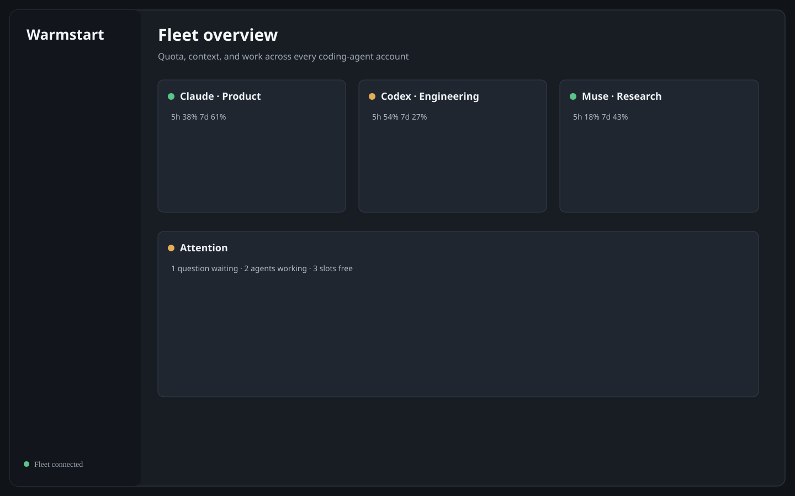
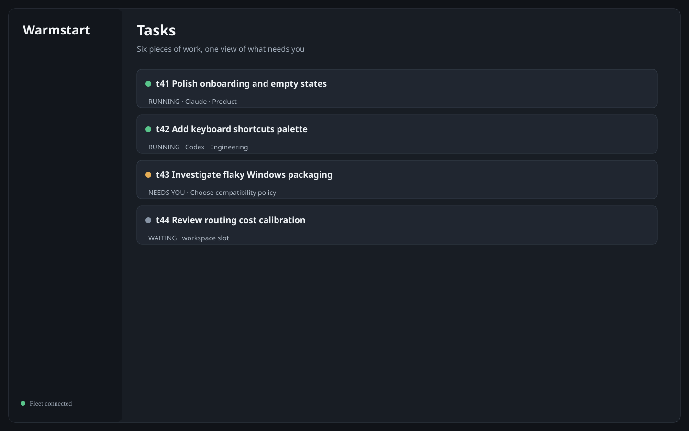
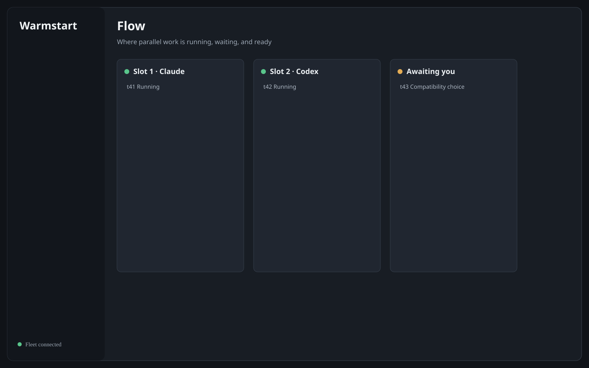
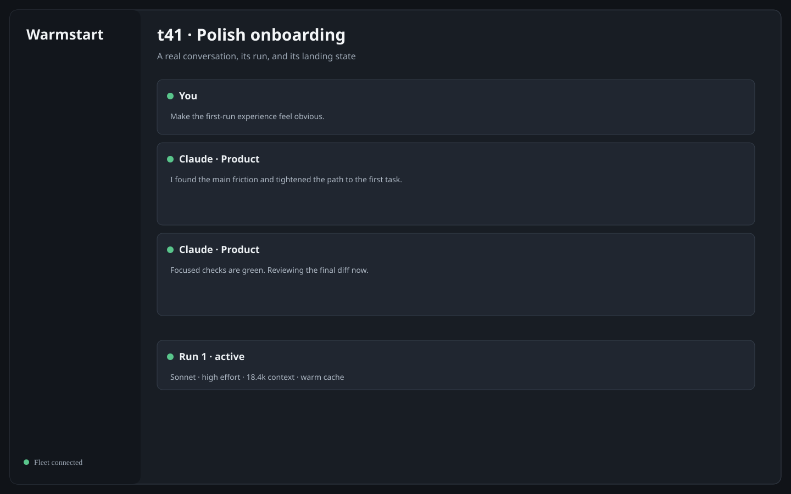
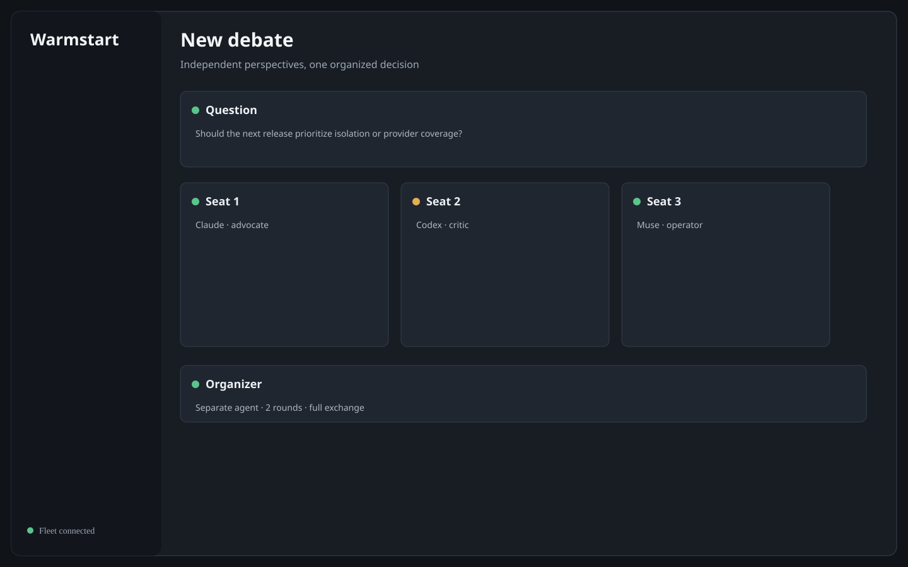
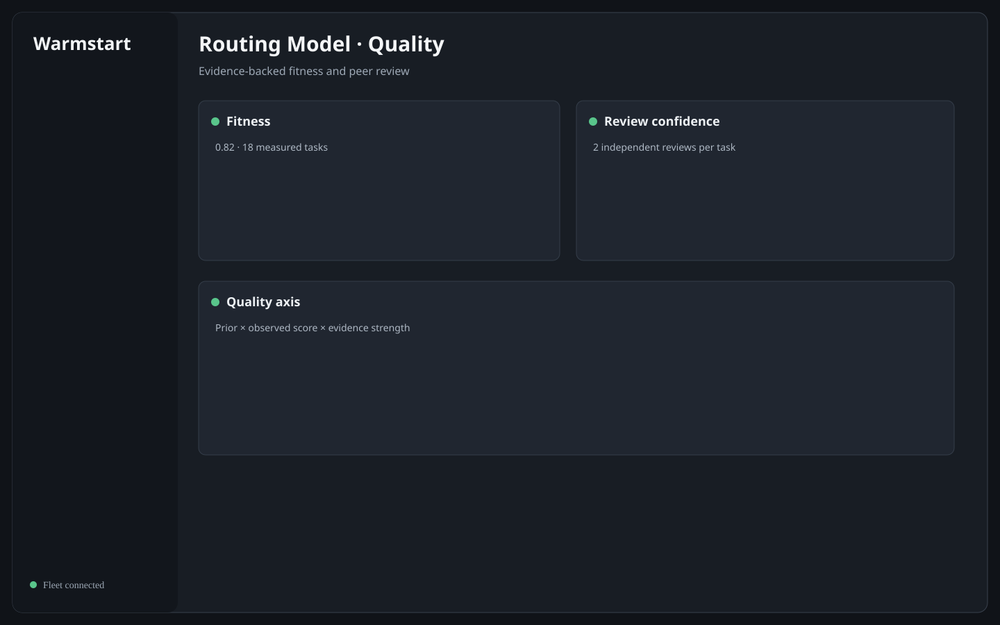
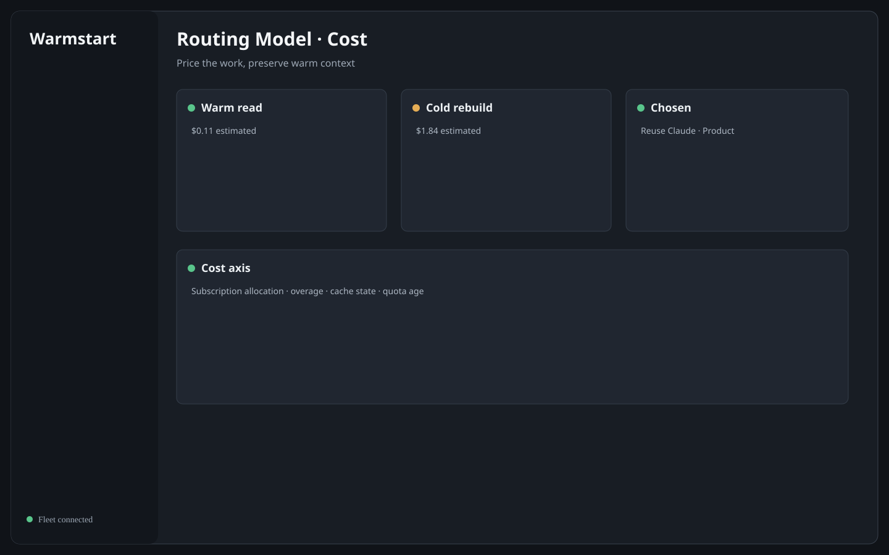
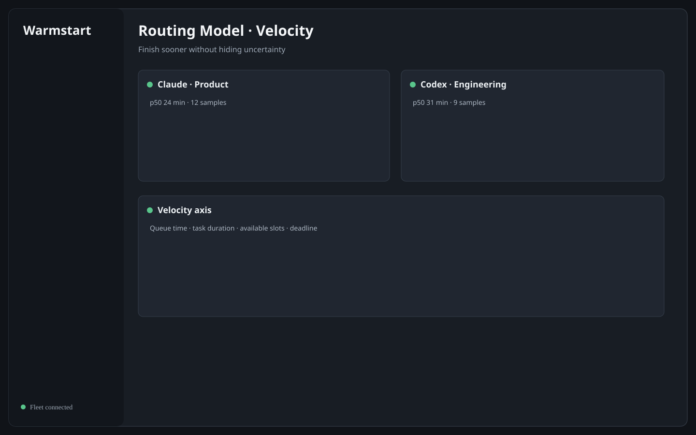
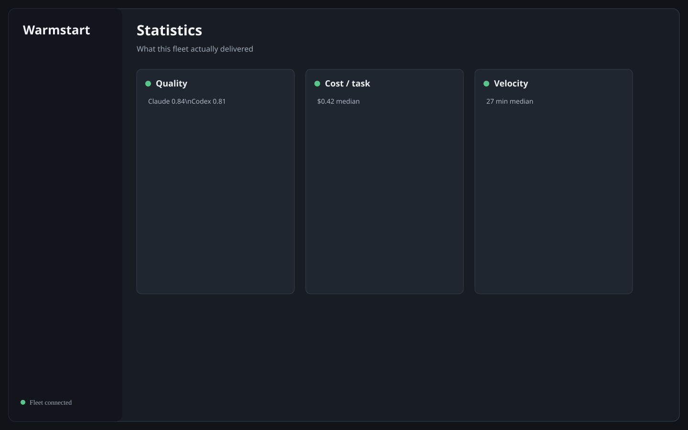

# Warmstart

### Run more coding agents. Manage less chaos.

Warmstart is a desktop control room for your AI coding agents. Give it the accounts you already
use, queue the work that matters, and let it keep every available agent moving—without losing track
of quota, context, cost, or the decisions that still need you.

> [!IMPORTANT]
> **Pre-alpha.** Warmstart is tested on Windows. macOS is the next launch gate; Linux is not yet
> supported. Dispatched Claude Code and Antigravity agents run with your full OS-user authority.
> Read the [security model](docs/security.md) before using a repository you do not trust.

## One place for the whole fleet

| | |
|---|---|
| **Keep every account useful** — see live quota, reset times, active sessions, and warm context at a glance. | **Keep work moving** — run independent tasks in parallel while dependencies and workspace slots wait visibly. |
| **Step in only when needed** — questions, approvals, quota holds, and finished changes come back to one inbox. | **Route with evidence** — every choice balances quality, cost, and velocity, and keeps the arithmetic behind it. |



## See work, not terminals

Several agents can work at once. Warmstart gives each task its own branch and pooled worktree, keeps
blocked work out of their way, and shows exactly what is running, waiting, or ready for you.

| Parallel tasks | Workspace flow |
|---|---|
|  |  |

Open any task to read the real conversation, see what it used, inspect its changes, reply, reassign
it, or take over in a terminal without making the rest of the fleet wait.



## Use the right kind of thinking

Routine work takes one agent. Decisions that benefit from disagreement can open a **Debate**: choose
independent seats, control what they see from one another, and ask a separate organizer to resolve
the result.



## Know why a task went there

Warmstart scores eligible account-and-model pairs without spending a token. It weighs the priorities
you set against measurements from your own fleet, then stores the full derivation of every routing
decision. Unknown data stays unknown—it is never quietly treated as free or good.

| Quality | Cost | Velocity |
|---|---|---|
|  |  |  |



## Try it

You need Node.js 22+, Git 2.40+, and at least one supported agent CLI on `PATH`: Claude Code, Codex,
or Antigravity.

```bash
git clone https://github.com/shyoo/warmstart.git
cd warmstart
npm install
node scripts/ensure-electron.mjs
npm run dev
```

Then add an account in **Settings → Workers**, add a project, and file your first task. Warmstart
uses each vendor's own sign-in; it does not read, store, copy, or proxy your credentials.

## Built for the problem that starts after agent one

- **Quota-aware scheduling** across multiple legitimate subscriptions and providers.
- **Warm conversation reuse** so a follow-up does not rebuild context the agent already knows.
- **Safe task isolation** through pooled git worktrees and one branch per task.
- **Human gates that stay visible** instead of disappearing into terminal scrollback.
- **Finish policies** for review, checks, pull requests, or unattended landing.
- **Remote attention** from a paired phone or another Warmstart desktop over Tailscale.

Warmstart never writes a commit for an agent and never silently discards work it cannot land.
Cancellation preserves work; deletion is separate and human-only.

## Go deeper

- [Getting around Warmstart](docs/ui.md)
- [Architecture and guarantees](docs/architecture.md)
- [Routing model](docs/routing.md)
- [Cost, quota, and prompt caching](docs/cost-model.md)
- [Supported agent CLIs](docs/adapters.md)
- [Development and packaging](docs/development.md)
- [Complete documentation index](docs/README.md)

The previews use fictional tasks and quota—never a developer's real fleet. After a build,
`node scripts/generate-readme-assets.mjs` seeds an isolated showcase database and captures live PNG
equivalents from the real renderer.

Apache-2.0 — see [LICENSE](LICENSE) and [NOTICE](NOTICE).
