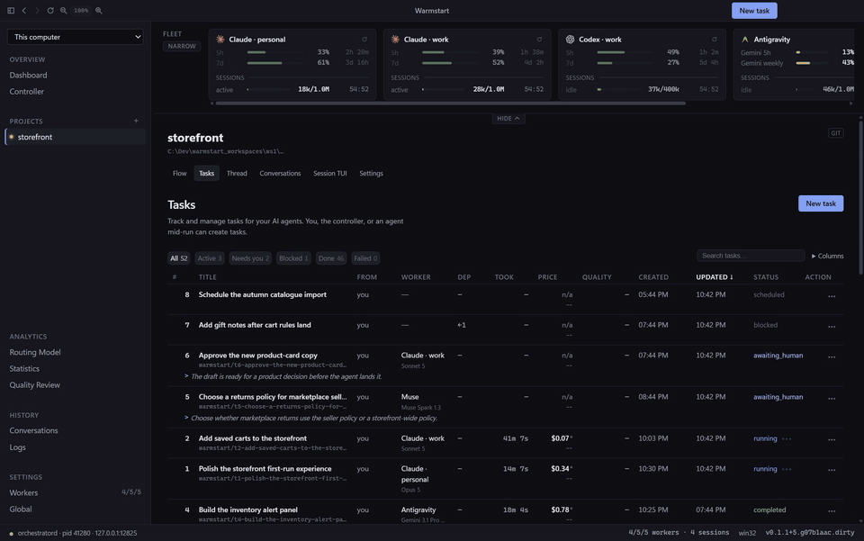

<div align="center">
  
  <h1>Warmstart</h1>
  <p><strong>One control room for every coding agent you already pay for.</strong></p>

[](https://github.com/shyoo/warmstart/stargazers)
[](https://github.com/shyoo/warmstart/releases/latest)
[](https://github.com/shyoo/warmstart/releases)
[](https://github.com/shyoo/warmstart/actions/workflows/ci.yml)
[](LICENSE)
[](https://warmstart.dev)

  <p><a href="https://warmstart.dev">warmstart.dev</a> · <a href="docs/getting-started.md">Getting started</a> · <a href="docs/README.md">Documentation</a> · <a href="https://github.com/shyoo/warmstart/releases">Releases</a></p>
</div>

Give Warmstart the Claude Code, Codex, and Antigravity accounts you already use. It runs tasks in parallel git worktrees, assigns each task to the right agent and model by live quota, cost, speed, and quality, and keeps expensive context warm. **You get one board for the work, the decisions, and the cost.**

> **Status: pre-alpha.** Windows is used every day; the macOS build is signed and notarised and has driven real agents. Linux is not supported. Unattended Claude Code and Antigravity agents run with **your full OS-user authority** — read [Security in brief](#security-in-brief) before pointing Warmstart at a machine that has anything else on it.

[](docs/images/demo.mp4)

<sub>**Illustrative.** The accounts, projects and this run are invented and staged; the app is real. Recorded by <code>scripts/record-demo.mjs</code> · <a href="docs/images/demo.mp4">MP4, 1920 px</a>.</sub>

## Why Warmstart

Flat-rate subscription CLIs are the best value in AI coding, but each comes with rolling 5-hour and weekly windows, reset schedules, prompt cache lifetimes, and separate terminals. Running multiple accounts or models quickly turns into manual bookkeeping: remembering which account has available quota, which terminal holds the context, and what finished where. Warmstart handles all of that for you.

## What Warmstart does for you

### Right agent and the right model, without thinking twice

Warmstart assigns every task itself, weighing live capacity, cost, speed, and measured quality. You describe the work; Warmstart picks who should do it.

- **Checks rolling quota windows:** Reads live capacity per account and holds work when an account cannot afford both the task and its active sessions.
- **Scores eligible candidates:** Ranks account, model, and session options on eleven terms, including cache age, preserved context, time until quota reset, and historical quality scores.
- **Transparent arithmetic:** Every dispatch records its score and reasoning right beside the decision, with unmeasured attributes kept explicit rather than guessed.

### Continue where the agent left off

Starting over forces an agent to reload instructions, tools, and repo context from scratch. Warmstart resumes the live session that already knows the work while its prompt cache is warm — saving up to 99.8% of new prefix tokens (cache reads cost 0.1× base price, while rebuilding an expired cache costs 2.0×). When a conversation grows too long, Warmstart compacts it into a concise summary before continuing.


### Every account's usage in one strip

See every account's rolling 5-hour and weekly windows, reading age, reset countdown, and active sessions. Hold an account out of rotation with a single click without signing out.

### Parallel work in pooled worktrees

Each project maintains a pool of isolated git worktrees. Every task automatically claims a worktree and a dedicated task branch. Tasks can depend on each other, run on schedules, or carry priorities, while the main trunk remains available for work that must run there serially.


### Prompts are tracked tasks

Every prompt becomes a tracked task with a status, worker, model, branch, duration, and price. Questions, approvals, quota holds, and finished diffs return to the same board as items you answer with one click, on desktop or from your phone.


### Hand-off between agents

When an account's quota window is nearly full or a run cannot finish, Warmstart commits what was done, wraps up the state, and either re-queues the task for the quota reset or hands it off to another account — even across different providers — to resume from the existing thread.

### Every task and run is priced

Every task records the share of subscription capacity and overage it consumed. Where pricing cannot be determined, Warmstart explicitly reports `unpriced` rather than showing a misleading zero.


### Quality review feeds routing

A peer agent from a *different* provider grades finished work against a fixed rubric — never the author itself. The score feeds into future routing decisions as a quality signal, without ever excluding candidates on its own. Statistics plots your fleet's measured trade-offs across quality, cost, and speed.


### Your phone, or another desktop (beta)

Pair a phone by QR code to check quota, answer questions, and dispatch tasks from anywhere. Pair another desktop over Tailscale to control that machine's fleet remotely.

### Nothing is lost quietly

Warmstart never commits on an agent's behalf without explicit instruction, and cancel never destroys work. Branches with unmerged work or uncommitted changes surface under *Loose ends*, where you can inspect, merge, or delete them on your own terms.

## Five ways to file a task

| Kind | How it runs | Best for |
|---|---|---|
| **Single Task** | One autonomous turn including verification and landing. It can pause to ask questions when needed. | Bugs, features, and docs with a concrete outcome. |
| **Conversation** | An ongoing thread. The agent pauses after each turn and commits only when you approve. | Ambiguous ideas, design discussions, and guided tasks. |
| **Plan & Execute** | One planner hands a written instruction to one executor, with no review turn to pay for. | A strong model planning and a cheaper one implementing. |
| **Plan & Split** | A planner breaks work into dependent tasks, multiple agents implement them in parallel, and the planner integrates at the end. | Large work with clear architectural seams. |
| **Debate** | Two to five seats answer blind; an organizer exchanges positions across rounds and synthesizes consensus and dissent. | Hard or ambiguous problems. Mixed providers beat multiple models from one vendor. |


## Install

### Requirements

- **Git 2.40+ is required** to create task branches and worktrees. **Node.js 22+** is required only to build from source.
- **GitHub CLI (`gh`) is required for `pull-request` delivery.**
- **Tailscale is optional** for paired remote-desktop access.
- At least one agent CLI on `PATH`, signed in to an account you own:

| CLI | Install | Needs |
|---|---|---|
| **Claude Code** | `npm install -g @anthropic-ai/claude-code` | a Claude Pro / Max / Team subscription |
| **Codex** | `npm install -g @openai/codex` | any ChatGPT plan, or an API key |
| **Antigravity** | `irm https://antigravity.google/cli/install.ps1 \| iex` | Google AI Pro or Ultra |

### Download

Installers are on the [Releases page](https://github.com/shyoo/warmstart/releases), with a `SHA256SUMS.txt` beside them.

- **macOS** — `warmstart-<version>-mac-arm64.dmg` (Apple Silicon) or `-mac-x64.dmg` (Intel). Signed with a Developer ID and notarised, so Gatekeeper opens it without ceremony.
- **Windows** — `warmstart-<version>-win-x64.exe` (or `-win-arm64.exe`). Per-user install, no administrator prompt. The build is **unsigned**, so SmartScreen shows *Windows protected your PC* on first run: click *More info* → *Run anyway*, and verify against `SHA256SUMS.txt` if you prefer.

Warmstart never installs an update on its own. It notifies you when a newer release is available and downloads the verified installer; launching it is always your choice.

### Build from source

```bash
git clone https://github.com/shyoo/warmstart.git
cd warmstart
npm install
node scripts/ensure-electron.mjs
npm run dev
```

`npm run dist` builds an installer for the current platform. Then follow [Getting started](docs/getting-started.md): add an account, add a project, and file a task. Muse and the local-LLM bridge are also available; see [the adapter reference](docs/adapters.md).

## Providers are not interchangeable

Different CLIs expose different capabilities to the scheduler:

| Capability | Claude Code | Antigravity | Codex |
|---|---|---|---|
| Accounts per machine | Unlimited | **One** (OS keyring) | Unlimited |
| Session compaction | Supported | — | — |
| Built-in action review | Supported | — | — |
| Cost metering | Exact token accounting | Live stream sampling | Live stream sampling |

Each difference is a declared capability that the scheduler evaluates during routing. Custom or unsupported CLIs can be declared via JSON in `<data dir>/adapters/`; they will run, but cannot be metered, receive no Warmstart MCP tools, and orphaned processes cannot be reaped automatically.

## Security in brief

Unattended Claude Code and Antigravity agents run with permission prompts bypassed, executing with **your full OS-user authority**. Codex executes inside its native sandbox by default, widened only to access the repository's shared `.git` directory — an operator may opt a Codex account into full user authority too (`--dangerously-bypass-approvals-and-sandbox`), the same permissive mode Claude Code and Antigravity already use. This is a per-account setting; a **Sandboxed only** account holds a task rather than run it with no real sandbox. Task mandates, landing gates, credential separation, and a scrubbed process environment strictly bound agent activity; read [docs/security.md](docs/security.md).

### Accounts and provider terms

Warmstart never reads, copies, stores, or proxies credentials. It invokes each provider's official CLI, authenticated through that vendor's standard login flow, keeping each account isolated in its own data directory. Warmstart monitors published quota usage, declines dispatches an account cannot afford, and pauses work before rate limits are hit. **Every account configured in Warmstart must be one you are legitimately subscribed to and authorized to use.** This does not constitute legal advice; your provider's terms of service govern.

## Roadmap

- Direct API-based model support alongside subscription CLIs.
- A first-class OpenCode adapter and additional CLI harnesses.
- Automated pull request review and code review workflows.
- A signed Windows release.
- Linux support.

## Documentation

[docs/README.md](docs/README.md) is the index.

| Page | Authority on |
|---|---|
| [architecture](docs/architecture.md) | Topology and invariants |
| [glossary](docs/glossary.md) | Domain words and concepts |
| [cost model](docs/cost-model.md) | Caching, quota, and metering |
| [routing](docs/routing.md) | Eligibility, scoring, and candidate selection |
| [adapters](docs/adapters.md) | Measured CLI capabilities and verified behaviors |
| [sessions](docs/sessions.md) | Continuation, compaction, and session reuse |
| [landing](docs/landing.md) | Finish policies, verification, and Loose ends cleanup |
| [data model](docs/data-model.md) | SQLite schema and enums |
| [external task debugging](docs/external-task-debugging.md) | Read-only task tracing and diagnostics |
| [MCP](docs/mcp.md) | MCP server tiers and integrated tools |
| [testing](docs/testing.md) | Test tiers (L1–L4) and verification invariants |
| [development](docs/development.md) | Environment setup, packaging, and CI |
| [UI](docs/ui.md) | Renderer architecture and design conventions |
| [remote](docs/remote.md) | Mobile companion app and Tailscale remote desktop |
| [security](docs/security.md) | Sandbox boundaries, grants, and unattended authority |
| [getting started](docs/getting-started.md) | First-run setup and walkthrough |
| [documentation index](docs/README.md) | What to read before changing things |

## Development

```bash
npm run dev
npm run typecheck
npm run lint
npm run build
npm run test
```

After `npm run build`, `node scripts/generate-readme-assets.mjs [scene …]` captures a five-account fictional fleet and composites each shot onto a backdrop.

## Repository layout

| Path | What it holds |
|---|---|
| `src/main`, `src/preload` | Electron shell. |
| `src/renderer` | React UI. |
| `src/daemon` | Scheduler, cache clock, controller, PTYs, store, and MCP server. |
| `src/shared` | Types crossing a process boundary. |
| `costmodels/` | Versioned pricing data. |
| `docs/` | Maintained reference. |

## Licence

Apache-2.0 — see [LICENSE](LICENSE) and [NOTICE](NOTICE).
