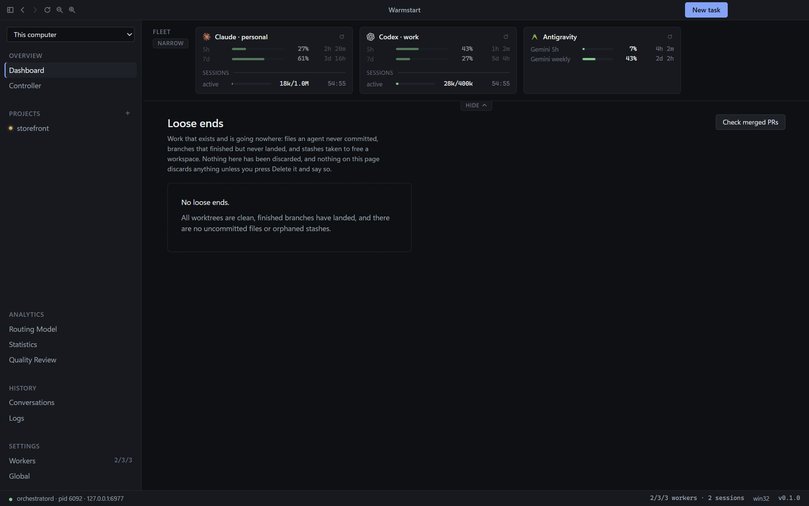
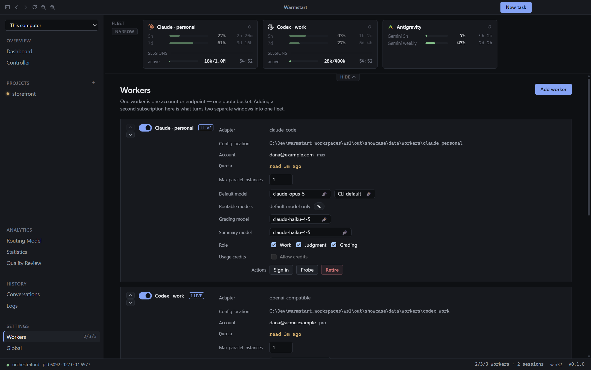
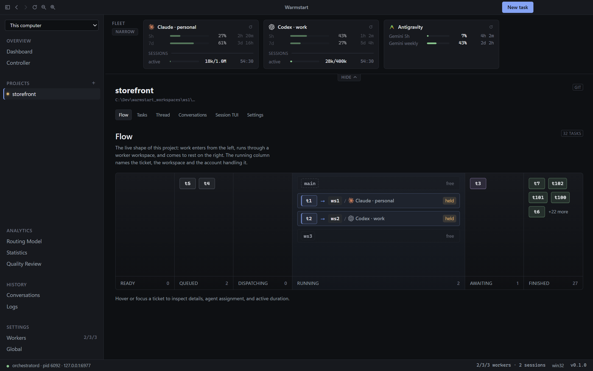
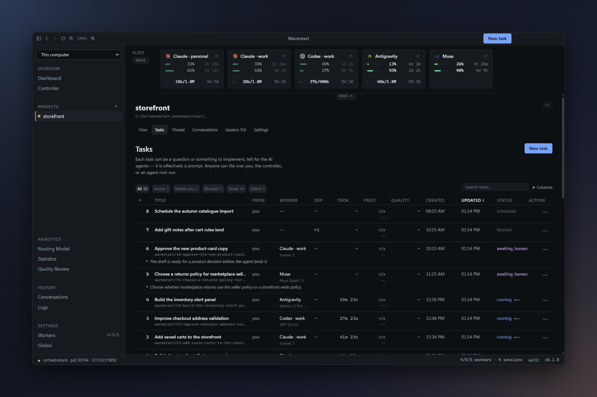
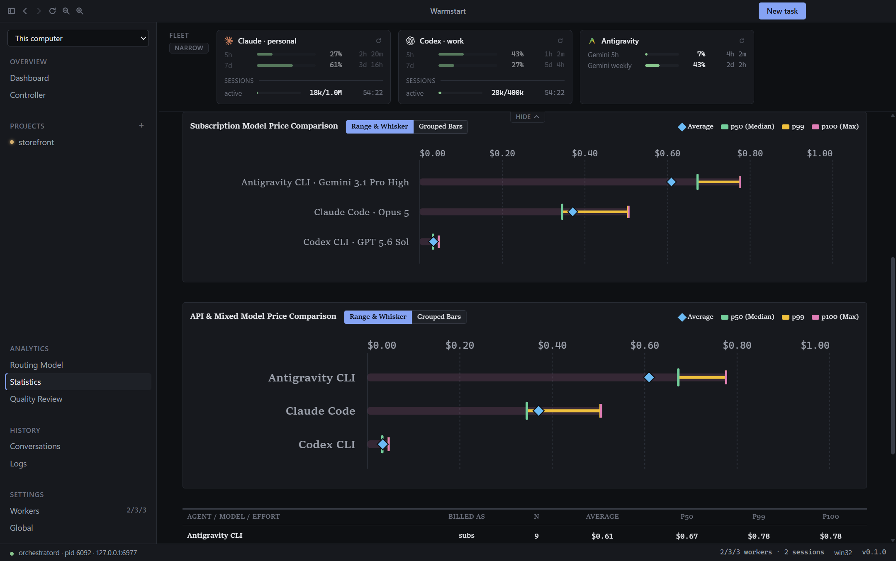
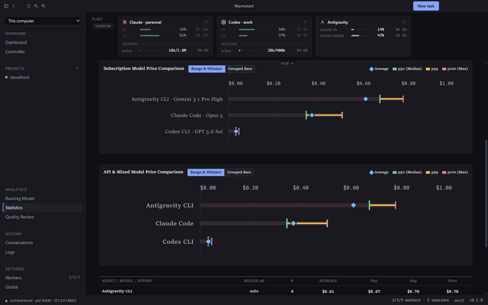
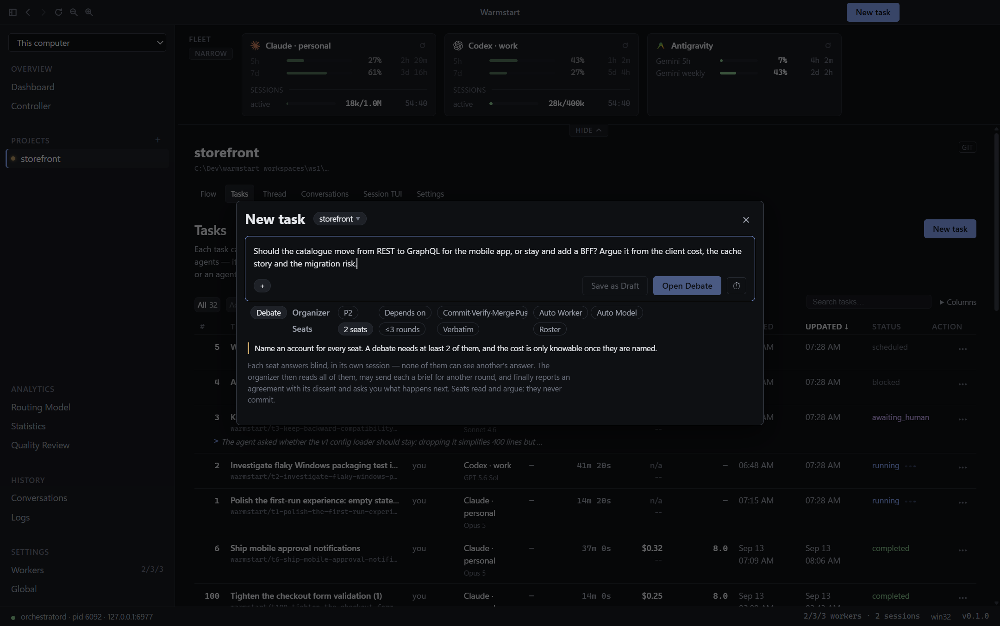

<div align="center">
  
  <h1>Warmstart</h1>
  <p><strong>One control room for every coding agent you already pay for.</strong></p>

[](https://github.com/shyoo/warmstart/stargazers)
[](https://github.com/shyoo/warmstart/releases/latest)
[](https://github.com/shyoo/warmstart/releases)
[](https://github.com/shyoo/warmstart/actions/workflows/ci.yml)
[](LICENSE)
[](https://warmstart.dev)

  <p><a href="https://warmstart.dev">warmstart.dev</a> · <a href="docs/getting-started.md">Getting started</a> · <a href="docs/README.md">Documentation</a> · <a href="https://github.com/shyoo/warmstart/releases">Releases</a></p>
</div>

Give Warmstart the subscription CLIs you already pay for — Claude Code, Codex and Antigravity — and a list of things to do. It runs each task in its own git worktree, routes it to the account and model that can afford it and best suits it, keeps expensive context warm, and brings every question, approval and finished change back to one place.

> **Status: pre-alpha.** Windows is where it is used every day. macOS builds and passes the test suites but has not yet driven a real agent; Linux is not supported. Unattended Claude Code and Antigravity agents run with **your full OS-user authority** — read [Security in brief](#security-in-brief) before pointing Warmstart at a machine that has anything else on it.



## Why Warmstart

Flat-rate subscription CLIs are the best value for agentic coding, but each has its own 5-hour and weekly windows, resets, prompt cache and terminal. Running several at once becomes a job of remembering which account still has room and which conversation still has context. Warmstart does that job.

## What Warmstart does for you

### Smart routing

Every dispatch scores eligible account, model and session candidates on your quality, cost and velocity weights. It counts live quota, a warm session for the project, and how that model has scored here before; the arithmetic is stored beside the decision.

### Token-aware session reuse and early compaction

A stopped conversation is resumed, not restarted. A session is reused only while its prompt cache is warm: cache reads are 0.1× while rebuilding is 2.0×. The scheduler decides whether to send, keep warm, compact or let go, and shows which.



### Every account's usage in one strip

See 5-hour and weekly windows per account with their age and reset countdown, live sessions, and a switch to hold an account out. The dashboard above keeps the fleet in one place.

### Parallel work in pooled worktrees, with dependencies and schedules

Each project has a pool of git worktrees; each task takes one and a branch named after itself. Tasks can depend on each other, be scheduled and carry priorities; the trunk is available for one-at-a-time trunk work.



### Prompts are tasks

The Tasks board is the to-do list: every prompt has a status, worker, model, branch, duration and price. Questions, approvals, quota holds and finished diffs come back as items you answer with one click, here or from your phone.



### Hand-off between agents

When an account window is about to close, or a run cannot finish, work is wrapped up and re-queued for the reset or handed to another account, including one on a different vendor, which resumes from the thread.

### Every task and run is priced

Each price is a share of the subscription it ran on plus any overage. Where nothing knew the price, Warmstart says `unpriced` rather than a quiet zero.



### Quality review feeds routing

A finished task is graded by a peer agent from a different vendor against a fixed rubric, never its own author. The score is one routing-fitness term and can never exclude a candidate. Statistics plots measured models on quality, cost and velocity.



### Your phone, or another desktop (beta)

Pair a phone by QR code to see quota, answer what is waiting and file tasks; pair another Warmstart desktop over Tailscale to drive that computer's fleet.

## Five ways to file a task

| Kind | What happens | Best for |
|---|---|---|
| **Single Task** | Autonomous one turn including landing; it can still ask a question. | Bugs, features and docs with a tangible outcome. |
| **Conversation** | A thread you keep talking in; it stops after each turn and commits when you say. | Ambiguous ideas and human-in-the-loop work. |
| **Plan & Execute** | One planner hands to one executor, with no review turn to pay for. | A strong model planning and a cheaper one implementing. |
| **Plan & Split** | A planner files dependent pieces, several agents implement, and the planner integrates. | Large work. |
| **Debate** | Two to five seats answer blind; an organizer exchanges positions and reports agreement with dissent. | Hard or ambiguous problems; mixed vendors are recommended. |



## Install

### Requirements

- **Git 2.40+ is required** to create task branches and worktrees. **Node.js 22+** is required only to build from source.
- **GitHub CLI (`gh`) is required for `pull-request` delivery.**
- **Tailscale is optional** for paired remote-desktop access.
- At least one agent CLI on `PATH`, signed in to an account you own:

| CLI | Install | Needs |
|---|---|---|
| **Claude Code** | `npm install -g @anthropic-ai/claude-code` | a Claude Pro / Max / Team subscription |
| **Codex** | `npm install -g @openai/codex` | any ChatGPT plan, or an API key |
| **Antigravity** | `irm https://antigravity.google/cli/install.ps1 \| iex` | Google AI Pro or Ultra |

```bash
git clone https://github.com/shyoo/warmstart.git
cd warmstart
npm install
node scripts/ensure-electron.mjs
npm run dev
```

`npm run dist` builds an installer for the current platform. Builds are unsigned: Windows SmartScreen warns and macOS Gatekeeper requires manual clearance. Then follow [Getting started](docs/getting-started.md): add an account, add a project, file a task. Muse and the local-LLM bridge are also available; see [the adapter reference](docs/adapters.md).

## Providers are not interchangeable

| | Claude Code | Antigravity | Codex |
|---|---|---|---|
| Accounts per machine | unlimited | **one** (OS keyring) | unlimited |
| Can compact a long session | ✔ | — | — |
| Something reviews each action | ✔ | — | — |
| Warmstart can meter its cost | exactly | from the live stream | from the live stream |

Each difference is a capability the scheduler reads. A CLI Warmstart does not know can be declared as JSON in `<data dir>/adapters/`; it runs, but cannot be metered, gets no Warmstart tools and its orphans are never reaped.

## Security in brief

Unattended Claude Code and Antigravity work runs with permission checks bypassed, as your OS user. Codex runs in its own sandbox, widened only to reach the repository's shared `.git`. A project can be set to **Sandboxed only**. The task mandate, landing gate, credential separation and restricted spawned environment bound an agent; read [docs/security.md](docs/security.md).

### Accounts and your providers' terms

Warmstart never reads, copies, stores or proxies a credential. It runs each vendor's own CLI, signed in through that vendor's login flow, with each account in its own isolation directory. It reads published usage, declines work an account cannot afford, and stops before a limit rather than after. **Every account you commission must be one you are separately and legitimately subscribed to and entitled to use.** This is not legal advice; your provider's current terms govern.

## Roadmap

- API-based models alongside subscription CLIs.
- A first-class OpenCode adapter and other harnesses.
- Pull-request review by agents and code review.
- A signed macOS release.
- Linux.

## Documentation

[docs/README.md](docs/README.md) is the index.

| Page | Authority on |
|---|---|
| [architecture](docs/architecture.md) | topology and invariants |
| [glossary](docs/glossary.md) | domain words |
| [cost model](docs/cost-model.md) | caching, quota and metering |
| [routing](docs/routing.md) | eligibility and scoring |
| [adapters](docs/adapters.md) | measured CLI capabilities |
| [sessions](docs/sessions.md) | continuation and reuse |
| [landing](docs/landing.md) | finish policies and Loose ends |
| [data model](docs/data-model.md) | SQLite schema and enums |
| [external task debugging](docs/external-task-debugging.md) | read-only task tracing |
| [MCP](docs/mcp.md) | MCP tiers and tools |
| [testing](docs/testing.md) | test tiers |
| [development](docs/development.md) | setup and packaging |
| [UI](docs/ui.md) | renderer conventions |
| [remote](docs/remote.md) | phone and remote desktop (beta) |
| [security](docs/security.md) | unattended authority |
| [getting started](docs/getting-started.md) | first run walkthrough |
| [documentation index](docs/README.md) | what to read before changing things |

## Development

```bash
npm run dev
npm run typecheck
npm run lint
npm run build
npm run test
```

After `npm run build`, `node scripts/generate-readme-assets.mjs [scene …]` captures a five-account fictional fleet and composites each shot onto a backdrop.

## Repository layout

| Path | What it holds |
|---|---|
| `src/main`, `src/preload` | Electron shell. |
| `src/renderer` | React UI. |
| `src/daemon` | scheduler, cache clock, controller, PTYs, store and MCP server. |
| `src/shared` | Types crossing a process boundary. |
| `costmodels/` | Versioned pricing data. |
| `docs/` | Maintained reference. |

## Licence

Apache-2.0 — see [LICENSE](LICENSE) and [NOTICE](NOTICE).
