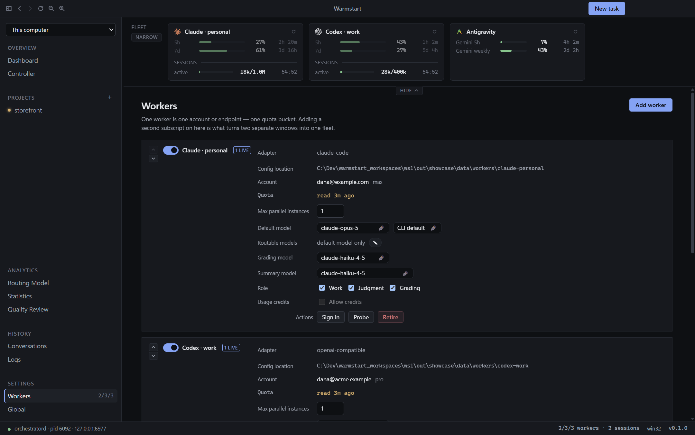
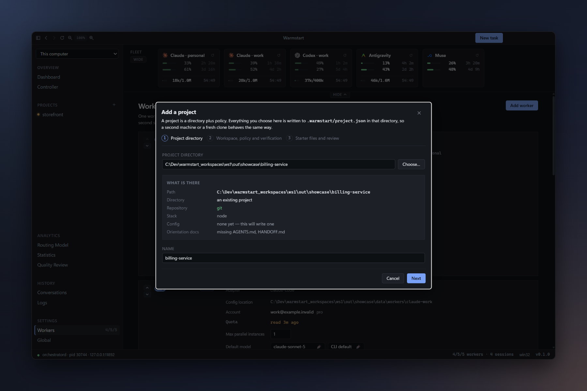
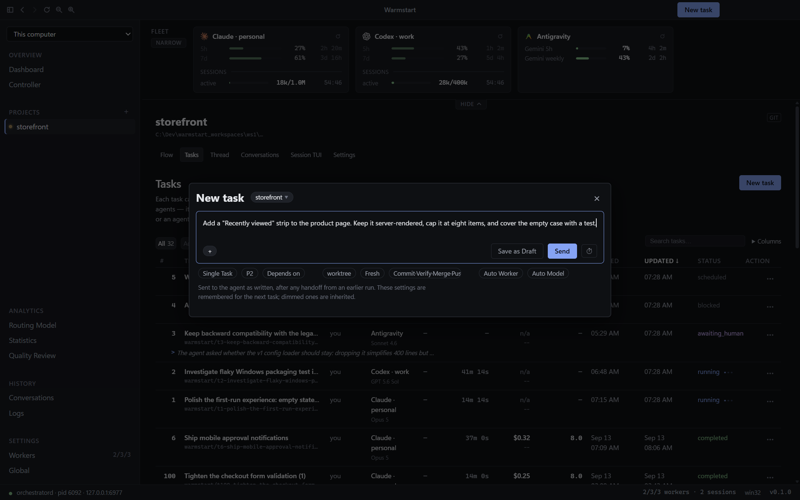
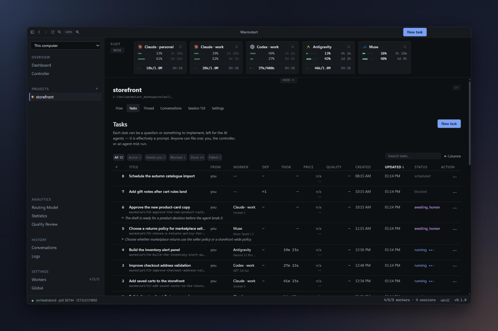
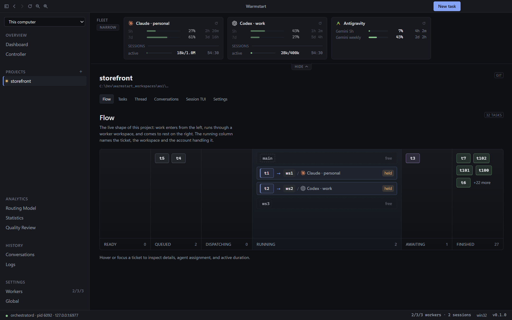
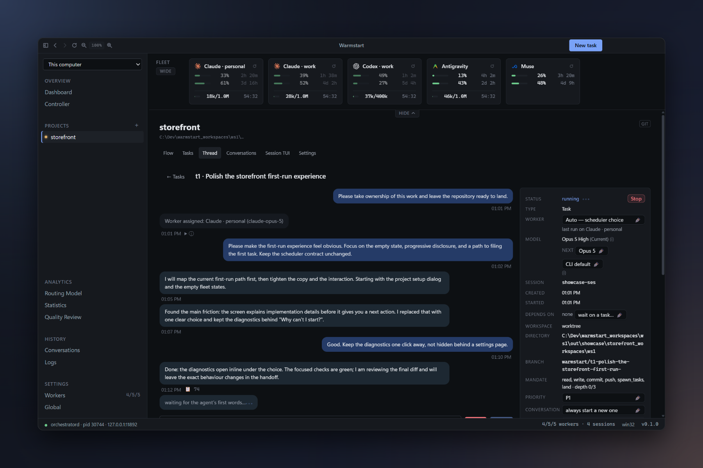
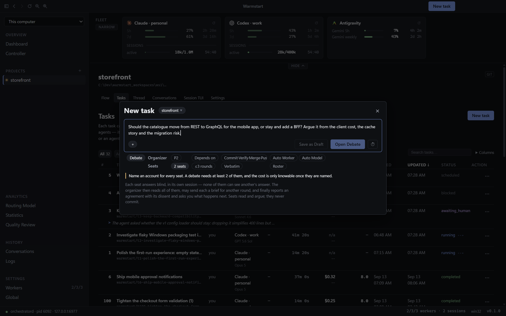

> **Audience:** people installing Warmstart for the first time.  
> **Authority for:** the first-run walkthrough and its task shapes.

# Getting started

## 1. Add an account

Open **Settings → Workers → Add worker**, choose a CLI and press **Sign in**. Warmstart opens the vendor login in an embedded terminal and reads back who signed in; each account has its own isolation directory.

## 2. Add a project

Press **+** beside Projects. The wizard inspects the directory, asks about worktrees, the landing branch, finish policy and checks, and changes nothing until **Create**.

For a new project, **Automatic (Warmstart)** keeps one worktree pool per project under `%LOCALAPPDATA%\warmstart\workspaces` on Windows. Choose **Custom directory** to keep that project's pool beside its repository or in another location on the same drive. Each project uses one pool location. Older projects keep their existing sibling pool unless you change the setting; no worktrees are moved silently. Archiving a project prunes idle managed worktrees after rescuing their changes; live trees and trees that cannot be made safe stay in place. Archive and Unarchive are in the project's right-click menu in the sidebar and in its Settings tab. Archiving is refused while any of the project's tasks can still run, and the funnel beside **Projects** shows archived projects again.

### Contributing to someone else's repository

Choose **Clone from GitHub** at the top of the wizard and enter `owner/repo` or a GitHub URL. The
destination defaults to the folder most of your projects are in. Tick **Fork it to my GitHub account**
to make a fork with the GitHub CLI. This requires `gh` to be installed and signed in, and the box
explains why when it is greyed out. **Clone** is the only step that writes before **Create**, and the
clone is kept if you cancel. After a clone:

- With a fork, **your fork is home**: it becomes `origin`, and the original becomes `upstream`.
  Tasks land into your fork (the finish policy is set to **commit, verify, merge and push**), so the
  fork can carry files of your own. A fork of a public repository is public.
- ⛔ Warmstart never opens a pull request on the original by itself. To send a task's work there,
  press **Propose upstream…** in the task's ledger: it shows the repository, the base and every
  commit and file that would go, replays only that task's commits onto the original's branch, and
  opens the pull request only when you press the button.
- The landing target is the repository's default branch.
- Warmstart's config is set to **This checkout only**. `.warmstart/` goes in `.git/info/exclude`,
  nothing is committed, no tracked file changes, and no starter docs are written. Put your own
  instructions in **Project settings › Cold start › Seeding prompt**. If the repository has a
  `CONTRIBUTING.md`, cold agents are told to follow it.
- Task branches are named `warmstart/t<n>`, with no words from your prompt, because a fork is public.

For an existing clone you added as a folder, choose **This checkout only** on the review step. If it
should push to a fork, set **Push remote** in Project settings, then press **Make my fork home** there
to make the fork `origin` and the original `upstream`. Warmstart refuses to push to, or open a pull
request on, a repository you do not maintain (anything below ADMIN or MAINTAIN on GitHub).

## 3. File a task

Use **New task** in the title bar. Its prompt, priority, dependencies, workspace, conversation reuse and finish policy are all visible in the composer.

| Kind | What it does |
|---|---|
| **Single Task** | Completes autonomously in one turn, including landing, and can ask a question. |
| **Conversation** | A thread you keep talking in; stops after each turn and commits when you say. |
| **Plan & Execute** | One planner hands to one executor, with no review turn. |
| **Plan & Split** | A planner files dependent pieces for several agents, then integrates them. |
| **Debate** | Two to five seats answer blind; an organizer reports agreement with dissent. |

## 4. Watch it work

**Tasks** shows who is running what, branch, duration and price. **Flow** shows the same work through its workspace pool.

## 5. Answer, review, land

Open a task to read its thread and ledger. Reply resumes the stopped conversation rather than restarting it.

| Policy | Outcome |
|---|---|
| `await-human` | Stop with the branch intact for review. |
| `commit-only` | Commit on its branch. |
| `commit-and-verify` | Commit, then run project checks. |
| `commit-and-merge` | Commit, verify, then fast-forward the local landing branch. |
| `commit-and-push` | As above, then push. |
| `pull-request` | Push and open a pull request. |
| `custom` | Follow the project instruction. |
| `report-only` | Deliver the thread, not a branch. |

## 6. When one opinion is not enough

Choose **Debate** for two to five independent, blind positions. An organizer can exchange positions between rounds and reports agreement with dissent; then you can execute, split, keep asking or stop.

